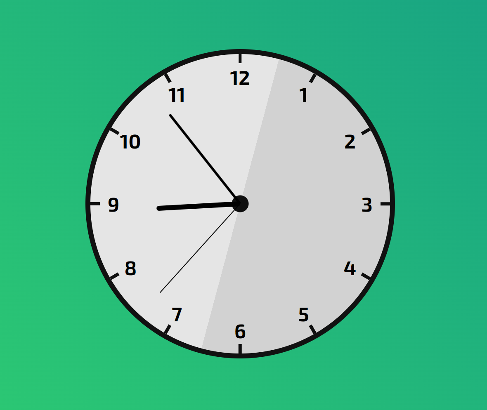

# Analog Clock Using HTML CSS And JavaScript

This is a beautiful Analog Clock created using HTML, CSS and JavaScript. 
To open it, just open the html page in any suitable browser.

Calculations done to make the clock moving are done inside the script.js file

Various different technologies are used for following tasks :

## HTML :

HTML is used for structuring the page and defining containers and different blocks.

## CSS : 

CSS has been used to make circular shapes, giving beautiful background color using linear-gradient, giving color to the clock and more.

## JavaScript : 

Js is used as a logic behind the moving hands of a clock.

## Calculations : 
 
Following calculations have been done in order to move all the hands in sync with the time of system.

    For Second Hand :

        1 rotation -> 60 sec
        60 sec -> 360 deg
        1 sec  -> 6 deg
        n sec  -> n*6 deg

        rotation of second hand in nth second -> n*6 deg
        
    For Minute Hand :

        60 sec -> 1 minute
        1 sec -> 1/60 minute
        n sec -> (n/60) minute

        1 rotation -> 60 min
        60 min -> 360 deg
        1 minute -> 6 deg
        m minute -> m*6 deg

        m minute n second -> (m + n/60) minute

        rotation of minute hand in mth minute nth second -> (m + n/60)*6 deg

    For Hour Hand :

        60 sec -> 1 minute
        1 sec -> 1/60 minute
        n sec -> (n/60) minute

        60 minute -> 1 hour
        1 minute -> 1/60 hour
        m minute -> m/60 hour

        m minute n second -> (m + n/60)/60 hour

        1 rotation -> 12 hours
        12 hours -> 360 deg
        1 hour   -> 30 deg
        p hour   -> p*30 deg

        p hour m minute n second -> (p + (m + n/60)/60) hour

        rotation of hour hand in pth hour mth minute nth second -> (p + (m + n/60)/60)*30 deg
